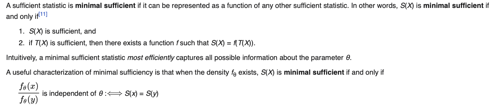
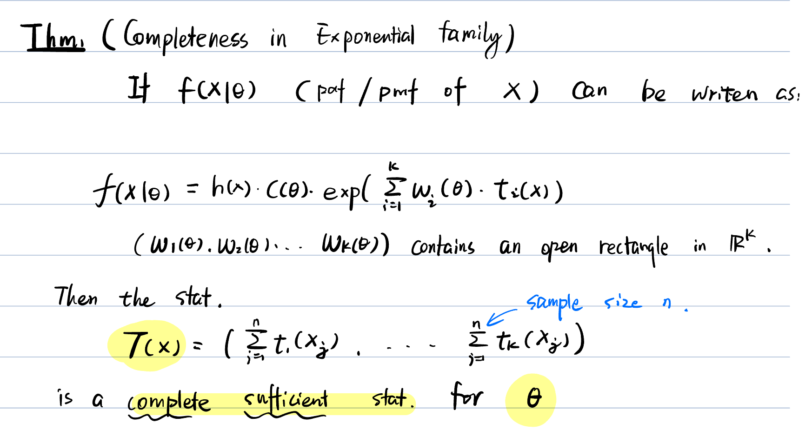
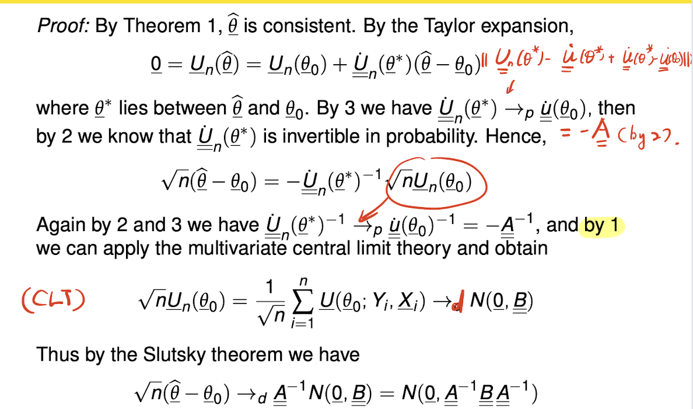
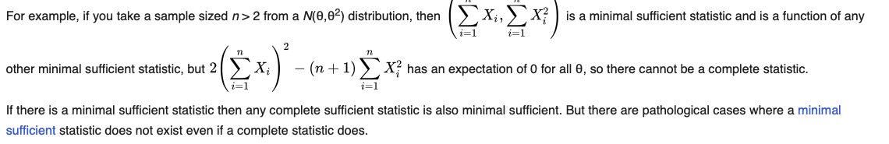
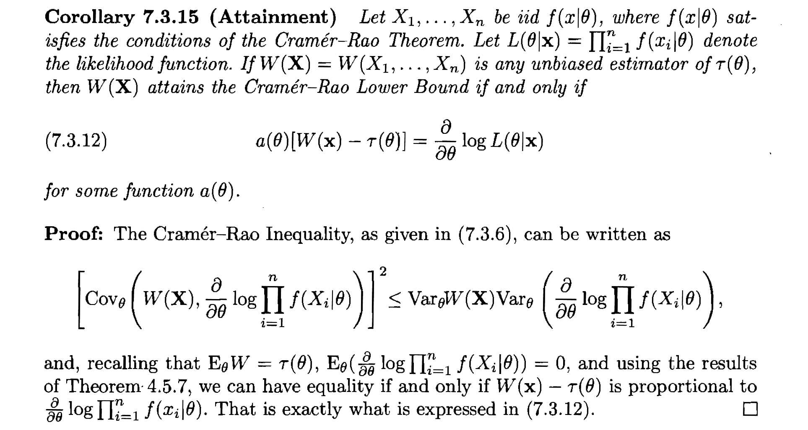

# Qualify Exam Review:

## Probability transformation

**Theorem** (Bivariate Transformation) For $(u,v) = g(x,y)$, suppose $g$ is a invertable map, then the p.d.f can be written as:
$$\begin{align*}f_{u,v}(u,v) = f_{x,y}(g^{-1}(u,v))\cdot|\frac{\partial g^{-1}(u,v)}{\partial(u,v)}|\end{align*}$$ 

$\color{red}{Remark:}$ The support of  $(u,v) \in \{g( x,y): f(x,y)>0\}$.

**Transformation of two random variables:**

* Poisson($\lambda_1)$+Poisson($\lambda_2$)  = Poisson($\lambda_1+\lambda_2$)
* Gamma($a,\theta$)+Gamma($b,\theta$) = Gamma($a+b,\theta$)
* If *X* ~ Gamma(α, θ) and *Y* ~ Gamma(β, θ) are independent, then.

Conditional Expectation (Good exercise!!!): https://stats.stackexchange.com/questions/61080/how-can-i-calculate-int-infty-infty-phi-left-fracw-ab-right-phiw

## Convergence Theory

**Definition**. (Converge in Prob.) 

> We say a sequence of random variables (r.v) $\{x_n\}$ converge in probability measure to $x$, if $\forall \epsilon>0$, $\mathbb{P}(|x_n-x|>\epsilon) = 0\ as\ n\to\infty$. Denote as $x_n\overset{P}{\to}x$.

**Lemma**. ==Continuity of Prob. Convergence==, for any continuous function $h()$, if $x_n\overset{P}{\to}x$ then $h(x_n)\overset{P}{\to}h(x)$.

**Lemma**. (Chebysheve Inequality) 

> Let X be a r.v with finite non-zero variance $\sigma^2$. Then for any real number $k>0$,
> $$\mathbb{P}(|X-\mu|\geq k)\leq \frac{\sigma^2}{k^2}$$
> $\color{red}Note:$ This inequality use the second moment to control the probability.

**Definition**. (Almost surely convergence)

> $x_n\overset{a.s}{\to}x$ if $P(\lim_{n\to\infty}|x_n-x|=0)=1$

**Lemma**. If $x_n,y_n$ a.s convergence to $x,y$ then $x_n+y_n\overset{a.s}{\to}x+y$, $x_ny_n\overset{a.s}{\to}xy$. (Usually, this can be combined with Strong LLN to show almost surely convergence)

**Theorem** (Strong LLN)

> If $x_1,\cdots,x_n$ are iid with $\mu$ and $\sigma^2<\infty$, then $\bar{x}_n\overset{a.s}{\to}\mu$.

**Definition**. (Convergence in distribution)

> $x_n\overset{D}{\to}x$ or called weakly convergence, if $\lim_{\to\infty} F(x_n) = F(x)$ for all test function $F \in C$.

**Theorem**. (Central limit theorem)

> If $x_1,\cdots,x_n$ are i.i.d with mean $\mu$ and finite variance $Var(x_1)= \sigma^2<\infty$, then
> $$\begin{align*}\frac{\sum_ix_i-n\mu}{\sqrt{n\sigma^2}}=\frac{\sqrt{n}(\bar{x}_n-\mu)}{\sigma}\overset{D}{\to}N(0,1)\end{align*}$$

**Theorem**. (Slutsky)

>If $X_n\overset{D}{\to}X$ and $Y_n\overset{D/P}{\to}C$ where C is a constant, then 
>$$\begin{align*}& X_nY_n\overset{D}{\to}CX\\& X_n+Y_n\overset{D}{\to}X+C\end{align*}$$

$\color{red}{Remark:}$

1. Almost surely convergence ==> Convergence in Prob ==> Convergence in Dist.
2. Convergence in distribution doesn't holds under addition and multiply operation. (Under cerntain conditions can be true, e.g. _Slutsky theorem_)

In order to extend the result from CLT to some function of a convergence r.vs. Here we introduce the _Delta Method_. 

**Theorem** (Delta method)

> If $\sqrt{n}(X_n-\mu)\overset{D}{\to}N(0,\sigma^2)$, and $g \in C_1$ then we have the following statement holds
> $$\begin{align*}\sqrt{n}(g(X_n)-g(\mu))\overset{D}{\to}N(0,g'(\mu)^2\sigma^2)\end{align*}$$

## Estimation Theory

* Sufficeint statistics (facotrization theorem)

* minimal sufficiency:

  

* Complete statistics: 

  > If T(x) is complete statistic of $\theta$, then for any measurable function $h(\cdot)$, if for all $\theta\in\Theta$ $E_\theta[h(T(X)) = 0]$ , then $P(h(T(X)=0) =1$. 

  * For **exponential family**: 

  > 

* Ancillary statistics: 

  example (Scale parameter):

  >For $x_1\sim Gamma(a,\theta), x_2\sim Gamma(b,\theta)$. $\frac{x_1}{x_1+x_2}$ has a distirbution free of $\theta$, because $x_1 = Y/\theta$ where $Y\sim Gamma(a,1)$

  **Theorem** (Basu)

  > If T(x) is ==complete sufficient== statistic and S(x) is an ==Ancillary statistic== then T(x) and S(x) are independent.

**MOM** estimator:

1. Consistency: the moment estimator is consistent estimator
2. Asymptotic properties: CLT+Delta method implies the mom estimator follows asymptotic normal distribution. 

**MLE** estimator:

1. Consistency: the MLE estimator is consistent estimator

2. Asymptotic properties: CLT method implies the MLE estimator follows asymptotic normal distribution. 

   

3. ==Regularity conditions==: 1)  $\hat\theta$ lies inside the parameter space. 2) Identifiable

#### UMVUE

**Theorem** (Rao-Blackwell: Condition on the sufficient statistics can reduce variance)

> For any unbiased estimators $W$ of $\tau(\theta)$, if $T$ is sufficient statistic for $\theta$, then $\phi(T) = E[W|T]$ is another unbiased estimator of $\theta$ with smaller variance.

**Theorem** (Lehman-sheffe)

> If $T$ is a ==complete sufficient statistic== for param, $\theta$, and $E(\phi(T)) = \tau(\theta)$. Then $\phi(T)$ is the UMVUE for $\tau(\theta)$

$\color{red}{Remark}$: *Complete sufficeint statistic may not exist*:

> 

**Theorem** (CR-low bound)

> If the sample $X = (x_1,\cdots,x_n)$ and $W(X)$ satisfy differential intergral exhcangable. Then 
> $$
> Var(W(X)) \geq \frac{[\frac{d}{d\theta}E_\theta(W(X))]^2}{I_\theta}
> $$
> 

## Hypothesis Testing

**Definition** (Rejection region)

> $R  = \{x:T(x)>t_\alpha\}$, R is the set of sample values for which we will reject $H_0$.

**Definition** (Type 1 and 2 errors)

> Tyep I error: $\alpha = P(x\in R| H_0)$
>
> Type II error: $\beta = P(x\in R|H_1)$

**Definition** (Power function)
$$
\beta(\theta) = P_\theta(x\in R)
$$

**Likelihood Test**

1. Compute $LR = \frac{\sup_\Theta L(\theta|X)}{\sup_{\Theta_0} L(\theta|X)}$

2. Reject $H_0$ if the likelihood ratio is large

**Score Test**

The score test is based on the asymptotic properties of the score function (first order derivative of likelihood) $S(\theta) = \frac{\partial \ell(\theta|\vec{X})}{\partial \theta}$.

* $E(S(\theta)) = 0$ , $Var(S(\theta)) = I_n(\theta)$
* $S(\theta)\cdot I_n(\theta_0)^{-\frac{1}{2}} \overset{D}{\to} N(0,1)$ by CLT.

**Wald Test**

Use observed fisher information $se(\hat{\theta}) = \sum_i \ell''(\theta|x_i)$, By CLT and Slutsky theorem, we have the asymptotic properties:
$$
((\hat\theta-\theta_0)^T\hat{I}_n(\hat\theta)^{-1}(\hat\theta-\theta_0))\overset{D}{\to} \chi^2_p
$$
$\color{red}Remark$: Wald test is the default test in `R::lm()`. In general, 

#### **UMP Test**:

For point test $H_0: \theta = \theta_0, H1: \theta=\theta_1$: we have ==Neyman-Person thm== claims the test is of the form 
$$
R = \{x: f(x|\theta_1)\geq kf(x|\theta_0)\}
$$
For one side test $H_0: \theta \leq \theta_0, H1: \theta\geq\theta_1$:we have ==Karlin-Rubin Thm== (1) T is sufficient statistics for $\theta$ (2) The pdf of ==T== is Monotonic Likelihood Ratio (MLR). Then the test is
$$
R = \{x: T>t_\alpha\}
$$

**Definition** (Monotonic Likelihood Ratio)

> The family of distribution specified by pdf $f(x|\theta)$ has MLR if for $\theta_1<\theta_2$ the ratio $r(x) = f(x|\theta_2)/f(x|\theta_1)$ is non-decreasing in $x$.

$\color{red} Remark$: 

1. The Karlin-Rubin Thm also holds for $H_0: \theta = \theta_0, H1: \theta\geq\theta_1$.

## Confidence interval

Confidence interval is the inverse of test:

**Theorem** (9.2.2)

> Given a level $\alpha$ test of $H_0: \theta = \theta_0$ Let ==$A(\theta_0)$== be the acceptence region.  Then the confidence interval of $1-\alpha$ level is given by
> $$
> C(X) = \{\theta_0:X\in A(\theta_0)\}
> $$

**Pivot quantity**:

* For location-scale families: 

1. $\frac{\overset{-}{X}-\mu}{S}$ is a pivot for $\mu$
2. $\frac{Mid - \mu}{\sum|x_j-Mid|/n}$ is pivot for $\mu$

* CDF as pivot:

>Suppose T is sufficient statistic for $\theta$ with continuous distribution, $F_\theta(t)$ has a distribution $Unif(0,1)$. So $F_\theta(T)$ is a pivot quantity for $\theta$

$\color{red}Remark$: 

1. Monotone transformation of 95% CI is the 95% CI for the transformed parameter. (This properties could be used to construct CI for complex form of parameters)
